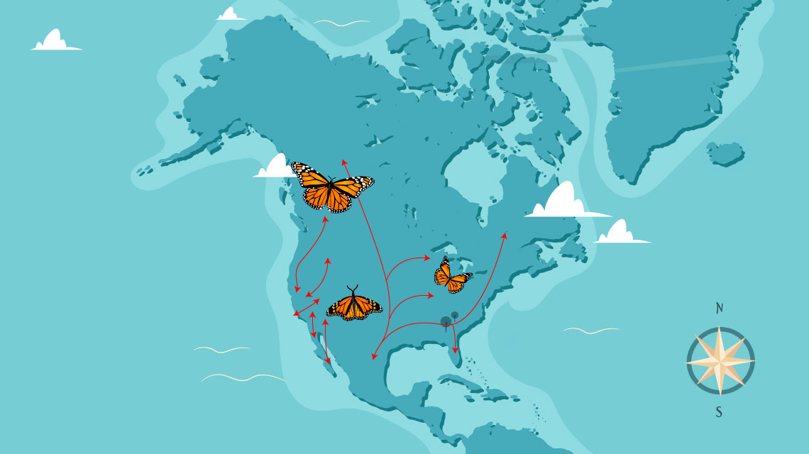
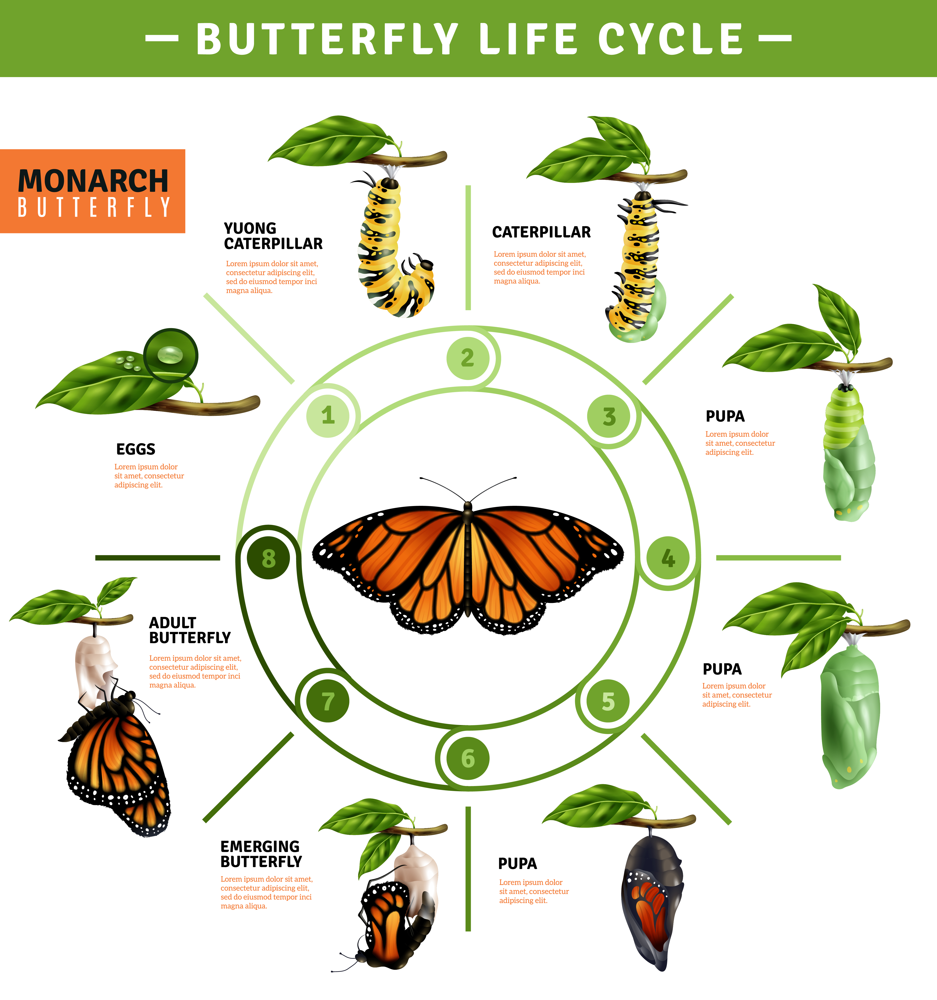
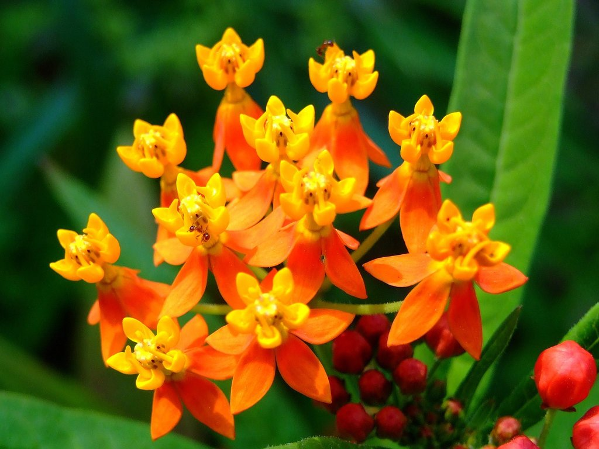

# Mariposa Monarca (*Danaus plexippus*)

Repositorio dedicado a la **mariposa monarca**, una de las especies más emblemáticas y estudiadas del mundo.  
El foco principal está en su increíble **migración**, un fenómeno único en la naturaleza.

---

## La Migración: Un Viaje Épico

*La migración de la mariposa monarca es considerada una de las maravillas del mundo natural.*

### Datos clave:

- **Distancia:** Viajan hasta ***4,500 kilómetros*** desde Canadá y Estados Unidos hasta los bosques de **Michoacán y Estado de México**.
- **Duración:** El viaje dura aproximadamente *dos meses*.
- **Generaciones:** Se necesitan de ***tres a cuatro generaciones*** para completar un ciclo migratorio anual.
- **Orientación:** Utilizan el *sol*, el *reloj circadiano* y el *campo magnético terrestre*.

> *"Ninguna mariposa monarca vive para hacer el viaje de ida y vuelta. Cada generación hereda la ruta sin haberla recorrido antes."*

*Migración de la mariposa monarca*

---

## Ciclo de Vida

La mariposa monarca pasa por **cuatro etapas**:

1. **Huevo** – Depositado exclusivamente en plantas de *algodoncillo* (*Asclepias*).
2. **Oruga** – *Solo come algodoncillo*, lo que la hace *tóxica* para los depredadores.
3. **Crisálida** – Transformación completa en *aproximadamente 10 días*.
4. **Adulto** – Vive entre *2 y 6 semanas*, excepto la *generación migratoria* que vive hasta *8 meses*.

*Huevo, oruga, crisálida y adulto*

---

## Ruta Migratoria

La migración sigue tres rutas principales:

| Ruta | Región | Destino |
|------|--------|--------|
| **Ruta del Este** | Este de EE.UU. y Canadá | *Michoacán, México* |
| **Ruta del Oeste** | Oeste de EE.UU. | *Costa de California* |
| **Ruta Costera** | Noreste de EE.UU. | *Golfo de México* |

---

## Amenazas y Conservación

### Factores de riesgo:
- *Pérdida de hábitat* por deforestación en zonas de hibernación.
- *Disminución del algodoncillo* debido al uso de herbicidas.
- *Cambio climático* que altera las condiciones de migración.

### ¿Cómo ayudar?
- Plantar *algodoncillo* y *flores nativas*.
- Evitar el uso de *pesticidas*.
- Apoyar *reservas de la biosfera* como la de *Mariposa Monarca en México*.

---

